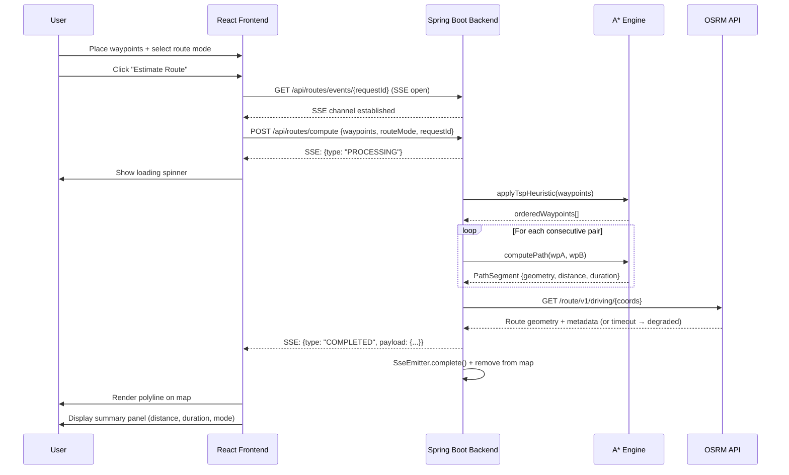

# USE CASES SPECIFICATION
> **Project:** RouteWise — Urban Route Optimizer  
> **Version:** 1.0  
> **Date:** 2026-04-14  
> **Status:** APPROVED  
> **Author:** Use Case Analyst Agent  

---

## ACTORS

| Actor           | Type   | Description                                                                              |
|-----------------|--------|------------------------------------------------------------------------------------------|
| **User**        | Human  | Urban commuter, delivery planner, or logistics team member using the web interface.      |
| **React Frontend** | System | Presents the map UI, manages waypoints, triggers requests, renders results.           |
| **Spring Boot Backend** | System | Orchestrates A* computation, TSP ordering, SSE events, and OSRM validation.   |
| **A* Engine**   | System | In-process Java service that computes shortest paths on the OSM graph.                   |
| **OSRM API**    | External | Public demo routing API used for cross-validation of computed routes.                 |

---

## UC-01 — Place Waypoints on the Map

**ID:** UC-01  
**Title:** Waypoint Placement  
**Actors:** User, React Frontend  
**Source Stories:** US-01  

**Pre-conditions:**
- The React application is running and the Leaflet map is rendered.
- No route computation is in progress.

**Main Flow (Happy Path):**
1. User opens the application; the map is centered on a default urban location.
2. User clicks on a location on the map.
3. Frontend adds a numbered pin (marker) at the clicked coordinates.
4. The waypoint appears in the waypoint list panel with its index number.
5. User repeats steps 2–4 until they have the desired number of waypoints (max 10).
6. The "Estimate Route" button becomes enabled once ≥ 2 waypoints are placed.

**Alternative Flows:**

| Code | Trigger | System Response |
|------|---------|-----------------|
| 1a | User attempts to place an 11th waypoint | Frontend shows a snackbar: *"Maximum of 10 waypoints reached."* No new pin is added. |
| 4a | User clicks the ✖ button on a waypoint in the list | The pin is removed from the map and the list re-indexes. If < 2 remain, "Estimate Route" is disabled. |
| 4b | User clicks an existing pin on the map | A tooltip shows the waypoint coordinates; no duplicate is added. |

**Post-conditions:**
- The waypoint list contains 2–10 `{lat, lng}` coordinates.
- The "Estimate Route" button reflects the correct enabled/disabled state.

---

## UC-02 — Request Route Computation

**ID:** UC-02  
**Title:** Route Estimation Request  
**Actors:** User, React Frontend, Spring Boot Backend  
**Source Stories:** US-02  

**Pre-conditions:**
- At least 2 waypoints are placed on the map.
- No computation is currently in progress.

**Main Flow (Happy Path):**
1. User selects route mode: `ROUND_TRIP` or `OPEN_ROUTE` via a toggle/dropdown.
2. User clicks the "Estimate Route" button.
3. Frontend generates a UUID `requestId`.
4. Frontend opens an SSE connection to `GET /api/routes/events/{requestId}`.
5. Frontend sends `POST /api/routes/compute` with waypoint list, `routeMode`, and `requestId`.
6. Backend validates input (2–10 waypoints, valid coordinates, valid routeMode).
7. Backend registers an `SseEmitter` keyed by `requestId`.
8. Backend immediately emits `PROCESSING` event via SSE.
9. Backend dispatches computation to a Java Virtual Thread.
10. Frontend displays a loading spinner and status message: *"Computing route..."*

**Alternative Flows:**

| Code | Trigger | System Response |
|------|---------|-----------------|
| 6a | Fewer than 2 waypoints in request body | Backend returns HTTP 400 with `{ "error": "VALIDATION_ERROR", "message": "Minimum 2 waypoints required." }` |
| 6b | Invalid coordinate (e.g., lat=200) | Backend returns HTTP 400 with field-level error details. |
| 6c | Invalid `routeMode` value | Backend returns HTTP 400 with `{ "error": "INVALID_ENUM", "message": "routeMode must be ROUND_TRIP or OPEN_ROUTE." }` |
| 4a | SSE connection fails before POST | Frontend shows error: *"Could not establish event stream."* Computation is not started. |

**Post-conditions:**
- An SSE stream is open between frontend and backend for the `requestId`.
- A `PROCESSING` event has been sent.
- A Virtual Thread is actively computing the route.

---

## UC-03 — Compute Optimal Route (A* + TSP)

**ID:** UC-03  
**Title:** Route Computation (Backend)  
**Actors:** Spring Boot Backend, A* Engine, OSRM API  
**Source Stories:** US-02, US-03  

**Pre-conditions:**
- Backend has received a valid `POST /api/routes/compute` request.
- OSM graph is loaded in memory.

**Main Flow (Happy Path):**
1. `RouteOptimizerService` receives the ordered waypoint list.
2. Service applies nearest-neighbour TSP heuristic to determine optimal visitation order.
3. For each consecutive waypoint pair in the TSP-optimized order, `AStarService` computes the shortest path on the OSM graph.
4. If `routeMode = ROUND_TRIP`, origin is appended as the final destination.
5. All segment paths are concatenated into a full-route GeoJSON LineString.
6. Total distance (km) and estimated duration (min) are aggregated across segments.
7. *(Optional)* `OsrmClientService` makes a validation call to OSRM API with the optimized ordered waypoints.
8. Backend emits `COMPLETED` SSE event with full result JSON payload.
9. Backend closes the SSE emitter and removes it from the in-flight map.

**Alternative Flows:**

| Code | Trigger | System Response |
|------|---------|-----------------|
| 3a | A* finds no path between two waypoints (unreachable nodes) | Backend emits `ERROR` SSE event: `{ "type": "ERROR", "message": "No path found between waypoints X and Y. Check if points are reachable by road." }` |
| 3b | Waypoint coordinates snap to ocean/off-road (no nearby graph node) | Backend returns nearest reachable graph node; if none within threshold (e.g., 500m), emits `ERROR`. |
| 7a | OSRM API times out or returns non-200 | OSRM result is omitted from payload; log warning; A* result is returned normally. |
| 7b | OSRM API is completely unreachable | Same as 7a — graceful degradation; no failure propagated. |

**Post-conditions:**
- `COMPLETED` or `ERROR` event emitted on SSE channel.
- SseEmitter removed from in-flight map.
- Result JSON logged at INFO level with `requestId` correlation.

**Example `COMPLETED` Payload:**
```json
{
  "requestId": "f47ac10b-...",
  "status": "COMPLETED",
  "routeMode": "ROUND_TRIP",
  "orderedWaypoints": [
    { "index": 0, "lat": -23.5505, "lng": -46.6333 },
    { "index": 1, "lat": -23.5620, "lng": -46.6548 },
    { "index": 2, "lat": -23.5505, "lng": -46.6333 }
  ],
  "totalDistanceKm": 4.72,
  "totalDurationMin": 14.3,
  "geometry": {
    "type": "LineString",
    "coordinates": [[-46.6333, -23.5505], [-46.6420, -23.5560], ...]
  },
  "osrmValidation": {
    "distanceKm": 4.85,
    "durationMin": 14.9,
    "status": "SUCCESS"
  }
}
```

---

## UC-04 — Stream Real-Time Computation Events

**ID:** UC-04  
**Title:** Event-Driven Status Updates  
**Actors:** React Frontend, Spring Boot Backend  
**Source Stories:** US-04  

**Pre-conditions:**
- Frontend has opened an SSE connection to `GET /api/routes/events/{requestId}`.
- Backend holds an active `SseEmitter` for the `requestId`.

**Main Flow (Happy Path):**
1. Backend emits `PROCESSING` event immediately upon receiving the compute request.
2. Frontend displays status: *"Connecting..."* then *"Computing route..."*
3. *(Optional intermediate events)* Backend may emit `PROGRESS` events for each completed segment.
4. Upon completion, backend emits `COMPLETED` event.
5. Frontend receives `COMPLETED` event and proceeds to UC-05 (Route Visualization).
6. SSE connection is closed by the backend (`SseEmitter.complete()`).

**Alternative Flows:**

| Code | Trigger | System Response |
|------|---------|-----------------|
| 1a | Client SSE connection drops before COMPLETED | Backend detects `onError` / `onCompletion` callback; removes emitter from map; logs warning. |
| 4a | Backend emits `ERROR` event | Frontend displays error snackbar with the error message. SSE connection closed. |
| 6a | SSE TTL (180s) expires before computation completes | Backend completes-with-error; frontend shows timeout message. A* thread continues but result is discarded. |

**Post-conditions:**
- Frontend reflects the final computation status (success or error).
- All SSE resources are cleaned up on both sides.

---

## UC-05 — Visualize the Route on the Map

**ID:** UC-05  
**Title:** Route Visualization  
**Actors:** User, React Frontend  
**Source Stories:** US-03  

**Pre-conditions:**
- Frontend has received a `COMPLETED` SSE event with valid result JSON.

**Main Flow (Happy Path):**
1. Frontend parses the GeoJSON LineString from the result payload.
2. Leaflet renders the polyline on the map, fitting the viewport to the route bounds.
3. Each waypoint marker is updated with its optimized sequence number.
4. A summary panel renders:
   - **Total Distance:** X.XX km
   - **Estimated Duration:** X min
   - **Route Mode:** Round Trip / Open Route
5. User can hover over any waypoint for coordinate details.
6. User can click "Reset" to clear all markers and start a new query.

**Alternative Flows:**

| Code | Trigger | System Response |
|------|---------|-----------------|
| 1a | GeoJSON geometry is malformed | Frontend logs error, displays snackbar: *"Invalid route geometry received."* |
| 6a | User clicks "Reset" during an active SSE stream | Frontend closes the EventSource, clears map, resets state. Backend cleans up when the SSE disconnects. |

**Post-conditions:**
- Route is visible on the Leaflet map as a coloured polyline.
- Summary metrics are displayed.
- UI is ready for a new route estimation.

---

## SYSTEM SEQUENCE DIAGRAM — Full Route Computation Flow



---

## DARK CORNERS — Identified Edge Cases

| # | Scenario | Risk | Mitigation |
|---|----------|------|------------|
| 1 | Waypoint placed in ocean or jungle (no road graph node nearby) | A* cannot snap to road network → no path | Snap to nearest node within 500m threshold; emit `ERROR` if none found |
| 2 | Two waypoints produce an unreachable pair (island, disconnected graph) | A* exhausts open set with no solution | Emit `ERROR` event with specific waypoint pair identified |
| 3 | SSE connection drops mid-computation | Resource leak in `ConcurrentHashMap` | Register `onCompletion` and `onError` callbacks on emitter to clean up |
| 4 | SSE TTL expires before computation finishes | Client stuck; emitter in zombie state | TTL=180s + `completeWithError` triggers cleanup; frontend shows timeout |
| 5 | OSRM API rate-limiting or downtime | Validation step delays or fails entire request | Graceful degradation: OSRM call has 5s timeout; failure → log + skip |
| 6 | User sends duplicate `requestId` (replay attack) | Two emitters mapped to same key → overwrite | Backend checks map before inserting; returns 409 Conflict if key exists |
| 7 | Very large OSM file causes OOM at startup | JVM heap exhausted | Document recommended JVM flags; config `routewise.osm.data-path` with regional subset |
| 8 | User places all waypoints at the same location | TSP produces trivial route; A* returns 0-distance path | Valid edge case — return 0 km, 0 min with a warning in the response |
| 9 | Browser doesn't support `EventSource` API | SSE consumer fails silently | Frontend checks for `EventSource` support; shows fallback message if absent |
